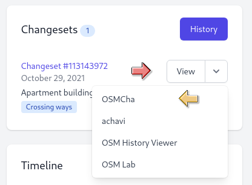
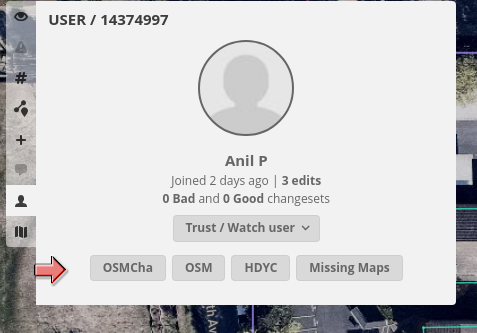
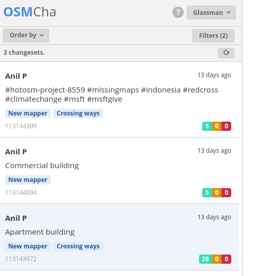
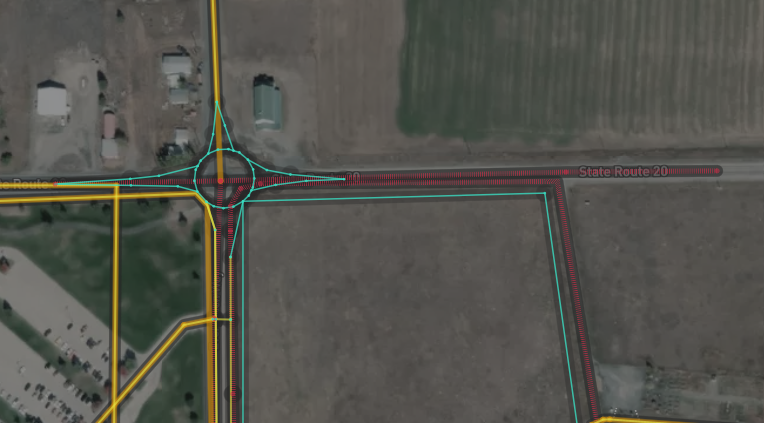
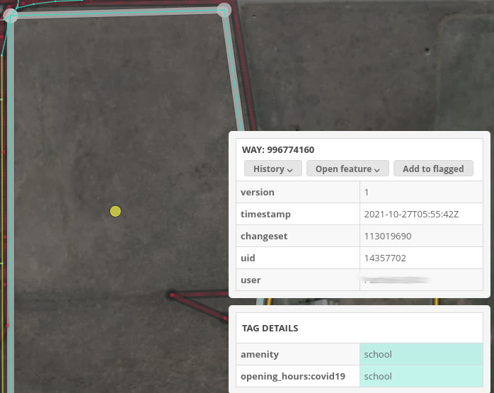
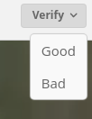
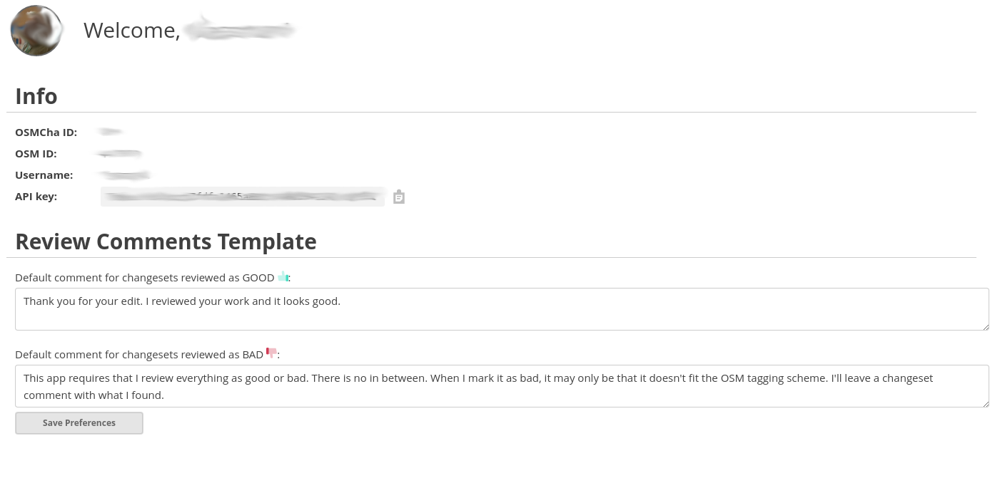
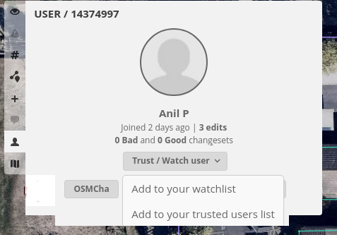

# Using OSMcha to Welcome New Mappers

**This is a short guide useful for reviewing new mappers first edits.**

The Welcome Tool identifies new mappers shortly after they make their first edits. Using OSMCha to review their edits allows us to give helpful feedback in a timely manner. OSMCha also lets us quickly spot unintentional or intentional damaging edits that we can quickly repair or revert. OSMCha also allows the formal review of their work when the mapper requests it. Additionally, a user can be added to a watchlist for later edits.

Thanks to Frans Schutz for his document *OSMCha How to review mappings on OSMCHA*[^1] which I used to create this document.

For a complete guide how to use OSMCha please refer to the OSMCha website[^2] 

### OSMCha Getting Started
Start with selecting the view pull down then select
This will open up OSMCha in a new tab. You may need to log in.

This screen pops up, showing most recent changesets with mappers name, number of changesets, and when they joined.

If the mapper has more than one changeset, view all of them by selecting OSMCha in the user section to show all of the new users changesets.

Select the first changeset to get an impression of the mappings.

The image above shows an example of a new user that thought their edits would not be live when uploaded. They just wanted to show what their city could look like. OSMCha show additions in blue, modifications in yellow and deletions in red. By selecting any on of the features OSMCha will show what tags were modified using the same color scheme. 

#### Reviews
There are two basic types of reviews, one the user requests and the other where you just want to add some tips. 

* User requested. OSMCha allows either a Good or Bad review.  These are canned changeset comments that will populate the comment field. 
* Welcome reviewer initiated which is the same as the requested one only without using the verify button. 

After reviewing the mappers work you can add a comment to the changeset.

### Review Tips
A quick and easy way to help new users is to provide them with mapping tips. This not only helps the user but is a quality check on our tools. Using a hashtag - #TIP: helps for searching for common tips that could be added to the editors validation tools. Below are some example of typical tips:

  * Instructions on how to square buildings 
  * Street names should not be abbreviated 
  * Instead of deleting and redrawing, modify the geometry to preserve the history
  * How to adjust the imagery offset
  * Draw just the roof outline of a building, not the entire area 
  * A number of the tips involved addresses including not deleting the address when deleting a poi
  * Descriptive names should not be use

### To Fix or not to Fix
Most likely if you are reading this you are a proficient mapper. So what do you do when you see an obvious error, either intentional or not. Something that you can easily fix. We should fix features that can have an adverse impact to our data consumers. For example, a dragged highway node. Or obvious vandalism. But if the problem isn't serious, leave a changeset comment asking the new mapper to fix the problem with an offer to help if needed.

### OSMCha Account Settings

In the OSMCha Account Settings, create draft comments for changesets reviewed as GOOD and and BAD. When you mark a changeset GOOD or BAD, you'll still have an option to modify the comment before posting.

#### Suggestions
* GOOD: Thank you for your edit. I reviewed your work and it looks good.
* BAD: This app requires that I review everything as good or bad. There is no in between. When I mark it as bad, it may only be that it doesn't fit the OSM tagging scheme. I'll leave a changeset comment with what I found.

### Watch List
OSMCha also allows creating a watch list. If there is a user you think needs following they can be added to your watch list. 

[^1]: https://docs.google.com/document/d/1Fl8xygCFe_qoEuW6db_I7ObMnri-_Y44lW4VBcJEoWo
[^2]: https://osmcha.org/about#introduction-to-osmcha